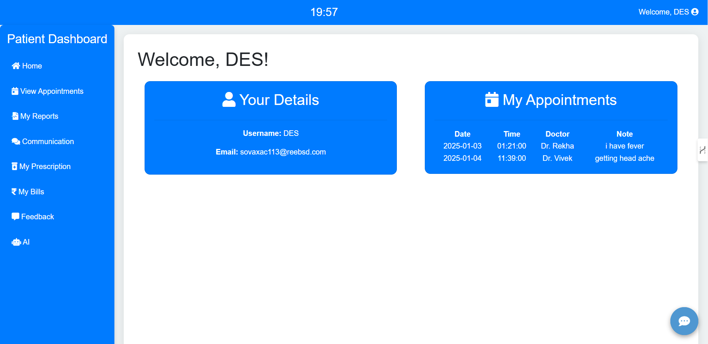
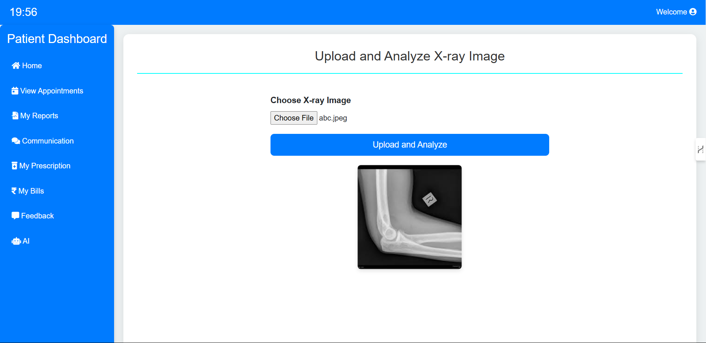
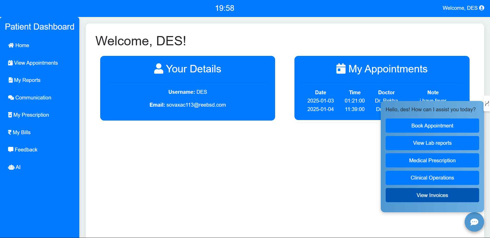
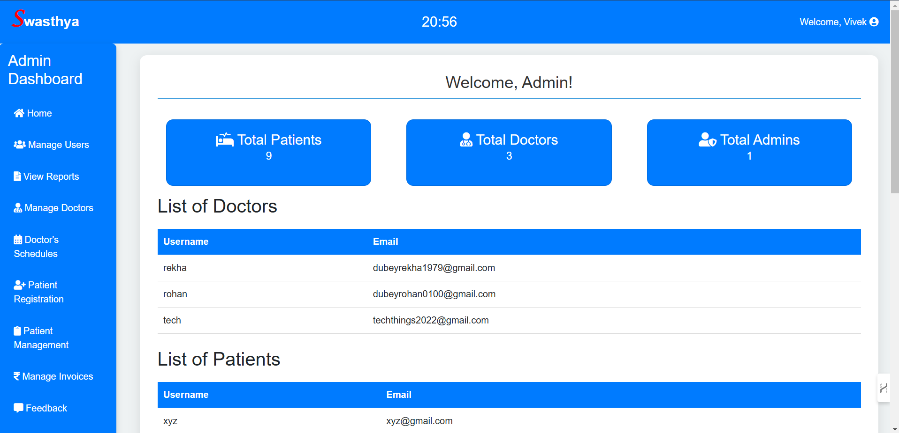
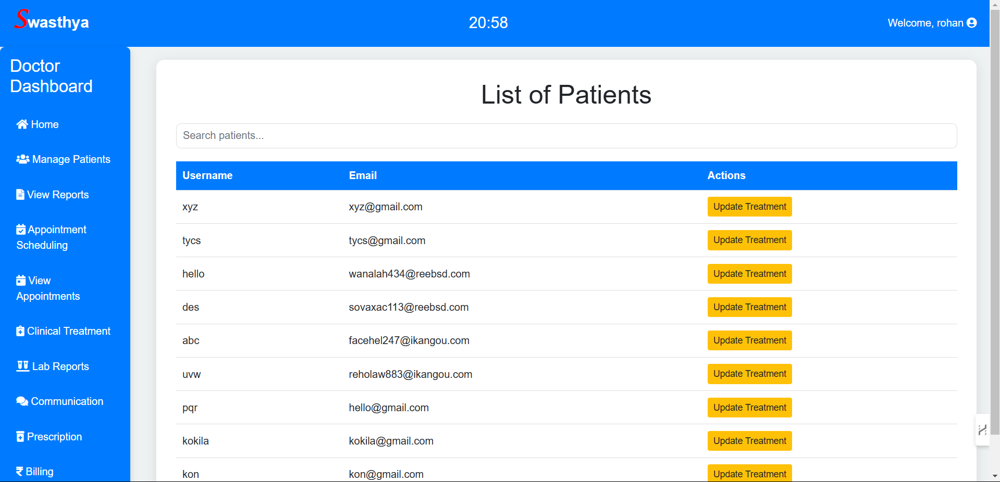

# Swasthya Healthcare Management System

## Description

Swasthya is an advanced and comprehensive healthcare management system meticulously designed to enhance the efficiency of patient care and healthcare administration. Built using PHP, this robust application incorporates a wide range of features to meet the needs of modern healthcare facilities. Key functionalities include seamless patient registration, efficient doctor management, and streamlined appointment scheduling, ensuring smooth coordination between patients and healthcare providers. 

A standout feature of Swasthya is its integration of AI-powered X-ray image analysis, offering quick and accurate diagnostic support to healthcare professionals. This feature not only improves diagnostic accuracy but also expedites the treatment process. The system emphasizes secure data handling to protect sensitive patient information, adhering to modern security protocols. 

For local development and testing, Swasthya leverages XAMPP, providing a reliable environment for developers to implement and refine its functionalities. With its user-friendly interface and cutting-edge capabilities, Swasthya is an indispensable tool for transforming the landscape of healthcare management.

## Prerequisites

Ensure you have the following installed:

- [XAMPP](https://www.apachefriends.org/index.html) (includes Apache, MySQL, PHP)
- [Composer](https://getcomposer.org/) (if required for PHP package management)
- [Chrome Browser](https://www.google.com/intl/en_in/chrome/). (For better look to project)

## Project Output

### Home Page

You can view the home page [here](home.html). 

### Patient Dashboard

### Xray Image Analysis with A.I

### Quick Access

### Admin Dashboard

### Doctor Dashboard

