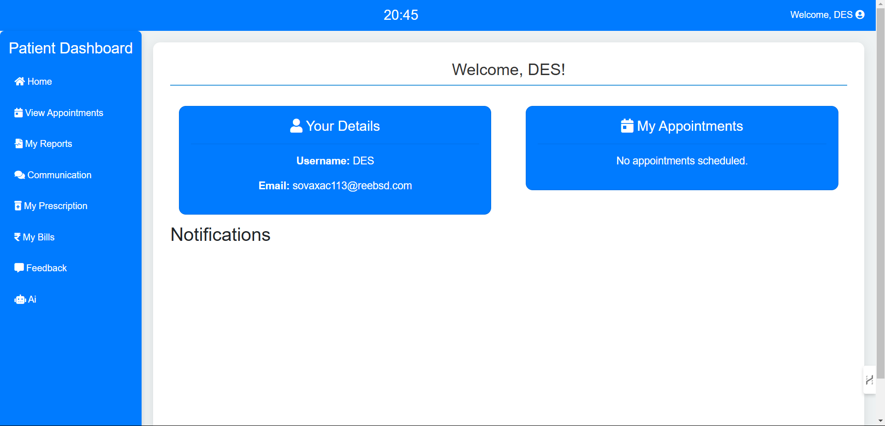

# Svasthya Healthcare Management System

## Description

SWasthya is a comprehensive healthcare management system designed to streamline patient care and healthcare administration. This PHP-based application integrates features such as patient registration, doctor management, appointment scheduling, and secure data handling. It utilizes XAMPP for local development and testing.

## Prerequisites

Ensure you have the following installed:

- [XAMPP](https://www.apachefriends.org/index.html) (includes Apache, MySQL, PHP)
- [Composer](https://getcomposer.org/) (if required for PHP package management)

## Project Output

### Home Page

You can view the home page [here](home.html). 

### Patient Dashboard

### Admin Dashboard

### Doctor Dashboard

